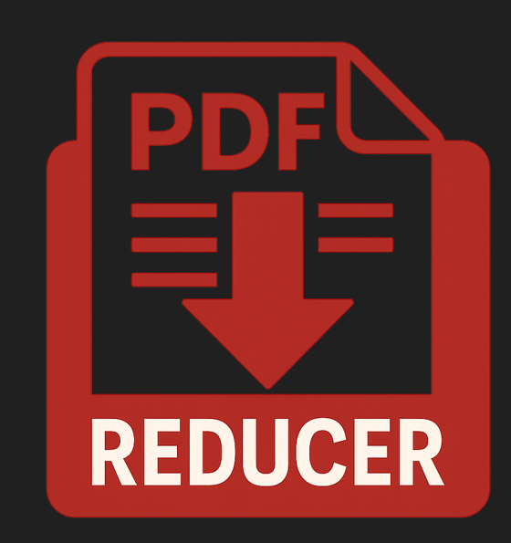
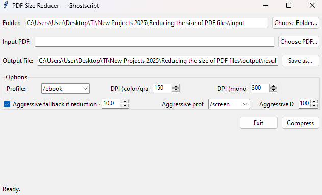

<table>
<tr>
  <td></td>
  <td><h1>PDF Size Reducer (GUI)</h1>

A simple **Python + Tkinter** tool to compress PDF files using **Ghostscript**.  
Provides a friendly interface to select a folder, choose a PDF, adjust compression settings, and save the optimized file.

---

## 🖼️ Screenshot

Here is how the application looks:



---

## ✨ Features
- Graphical interface with **Tkinter**
- Choose input folder and PDF file
- Choose output location
- Select Ghostscript profile (`/screen`, `/ebook`, `/printer`, `/prepress`)
- Adjust **DPI resolution** for images
- Optional **aggressive fallback**: re-runs compression if the first pass reduces less than a threshold
- Displays before/after file size and % reduction
- Works on **Windows, Linux, macOS** (requires Ghostscript installed)

---

## 📂 Project Structure

pdf-size-reducer/
├── main.py # Tkinter GUI script
├── input/ # (optional) put PDFs here
├── output/ # compressed files saved here
└── README.md


---

## ⚡ Requirements

- Python 3.9+
- [Ghostscript](https://ghostscript.com/releases/gsdnld.html) (must be installed and available in PATH)

No additional Python packages are required besides the standard library (`tkinter` is included with Python).

---

## ▶️ Usage

1. Install Ghostscript and make sure the `gs` (Linux/macOS) or `gswin64c.exe` (Windows) command is available in your PATH.
2. Clone or download this repository.
3. (Optional) Create a virtual environment:
   ```bash
   python -m venv .venv
   source .venv/bin/activate   # Linux/macOS
   .\.venv\Scripts\activate    # Windows PowerShell

---

## The GUI window will open:

 - Choose Folder → Select the folder containing your PDF
 - Choose PDF → Pick a PDF file
 - Save as → Select where to save the compressed PDF
 - Adjust profile and DPI if desired
 - Click Compress

---

## Compression Profiles

 - Ghostscript presets: 
 - /screen – lowest quality, smallest size (~72 dpi)
 - /ebook – good balance for reading (~150 dpi)
 - /printer – higher quality (~300 dpi)
 - /prepress – highest quality, larger size
   
---

## Notes

- If the PDF is mostly text/vector, size reduction will be minimal.
- For scanned/image-heavy PDFs, reduction can be 50–80%. 
- Aggressive mode retries with lower settings if initial reduction is too small. 

---

## License

MIT License – feel free to use, modify and share.

---

## 👨‍💻 Author

Developed by Marcos Vinicius Thibes Kemer

---
